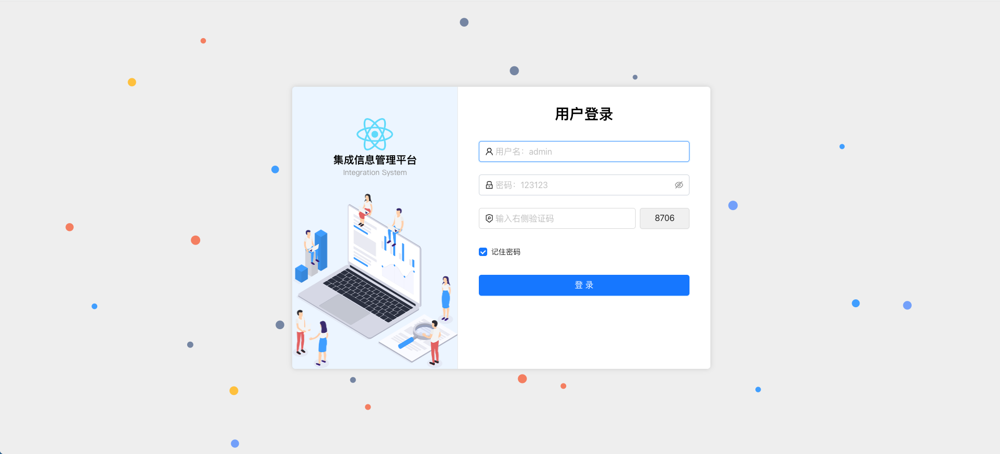

# 集成信息管理平台，用于将多种协议、多种系统进行耦合，通过配置服务并发布，可做到让不同厂商的系统进行最简化的系统对接

# 框架技术：
    java            17
    springboot      3.2.5
    apache camel    4.5.0
    mybatis         3.5.4
# 注意
    后端接收的数据是前端通过特定方式进行了数据加密的，参考前端项目
    https://github.com/yecongling/integration-react

# 支持丰富的交互协议，http、soap、RPC、hl7(后续支持)、file 等等，其包含的功能大部分由 apache camel 中的组件所支持，也可自行扩充其中的组件

# 首页

# 项目维护模块

项目维护主要是为了管理项目，方便进行项目配置，项目配置主要包含项目基本信息、项目服务、项目服务接口、项目服务接口参数、项目服务接口参数配置等

# 端点维护模块

    端点主要就是每一个服务的开头或者结尾或者中间交互的，其作用就类似于接口，可以供外部调用，也可以调用外部，端点类型有很多，有队列服务的，有http服务的，有soap服务的，还有rpc服务的，有hl7服务的，有文件服务的，有队列服务的，有数据库服务的，有redis服务的

